<br />

<div align="center">

<a href="https://portfolio-mocha-three-71.vercel.app/">
  
</a>
&nbsp;&nbsp;
<a href="https://github.com/shraaaa17">
  
</a>
&nbsp;&nbsp;
<a href="mailto:shravanich.17@gmail.com">
  
</a>

</div>

</div>

---

## About
<div align="center">


</div>
I like working where **engineering, AI, data, product thinking, and visual design** meet — from building full-stack applications to experimenting with intelligent workflows and interactive experiences.

```text
22 · B.E. Information Technology
Full Stack Development · AI · FinTech · Web3
```

## Currently Brewing

| | |
|---|---|
| **Full-stack products** | Building polished, practical web experiences |
| **AI-powered applications** | Exploring intelligent workflows and decision systems |
| **FinTech / Risk Technology** | Prototyping safer, smarter financial experiences |
| **ML & Deep Learning** | Strengthening practical foundations |
| **DSA** | Going deeper on problem solving and fundamentals |

---

## Selected Work

<table>
<tr>
<td width="50%" valign="top">

### ElitePay

**FinTech · Web3 · AI**

Smart NFC payment ecosystem exploring offline payments, INR transactions, crypto-to-INR settlement, blockchain tracking, rewards, and AI-assisted risk analysis.

[View project →](https://github.com/shraaaa17/Elite.pay)

</td>
<td width="50%" valign="top">

### ChainSense AI

**AI · Optimization · Supply Chain**

Decision-intelligence prototype combining simulation, NSGA-II multi-objective optimization, Gemini reasoning, and interactive visualization.

[View project →](https://github.com/shraaaa17/chainsense.ai)

</td>
</tr>
<tr>
<td width="50%" valign="top">

### CleanChain AI

**Computer Vision · Blockchain**

Hackathon prototype exploring AI-based cleanup verification, impact scoring, and blockchain-backed environmental records.

[View project →](https://github.com/shraaaa17/CLEANCHAIN.AI)

</td>
<td width="50%" valign="top">

### DigiDeck

**Frontend · Product Experience**

Cinematic, video-first digital sales experience built around motion, storytelling, responsive interaction, and modern React/Next.js tooling.

[View project →](https://github.com/shraaaa17/digideck)

</td>
</tr>
</table>

---

## My Toolkit

**Languages**


**Frontend**


**AI / ML**


**Web3 · Tools**


---

## GitHub, Lately ☕


<br />

<div align="center">



</div>

---

## Research & Hackathons

| Area | Work |
|---|---|
| **Research** | Pathogenic SNV prediction and genomic variant analysis |
| **Research** | Multi-objective smart logistics optimization using MILP, Gurobi and NSGA-II |
| **Hackathon** | CleanChain AI — AI + blockchain environmental verification |
| **Hackathon** | ChainSense AI — AI-assisted supply-chain decision intelligence |
| **Product** | ElitePay — FinTech / NFC / Web3 product prototype |

---

## My Journey

```text
2024     Data Analytics & Technical Foundations
  │
2025     Research · ML · Smart Logistics Optimization
  │
2025/26  Hackathons · AI · Web3 · Product Prototyping
  │
2026     Full Stack Development · AI Product Engineering
  │
  └──→   deeper systems · DSA · ML · scalable product engineering
```

## Still Steeping

- **Full Stack Development**
- AI Product Engineering
- Deep Learning and practical AI systems
- FinTech and Risk Technology
- Data Structures & Algorithms
- Scalable product architecture

---

## Beyond Code

I enjoy the creative side of technology too — **design, illustration, music, visual storytelling, and experimenting with new product ideas**.

For me, code is the medium; the product and the experience are the outcome.

---

## Let's Connect

<div align="center">

[**Portfolio ✮💻**](https://github.com/shraaaa17/shravani-portfolio) · [**GitHub </>**](https://github.com/shraaaa17) · [**Email ˚.💌**](mailto:shravanich.17@gmail.com)

<br />

☕ **say hello over coffee**

<br />

<sub>made with curiosity · code · caffeine</sub>

</div>
